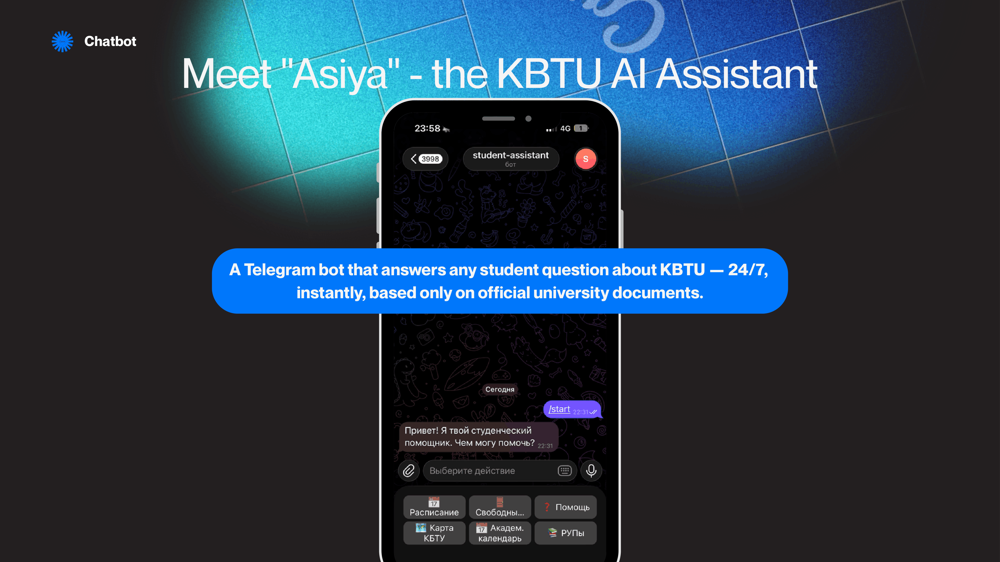
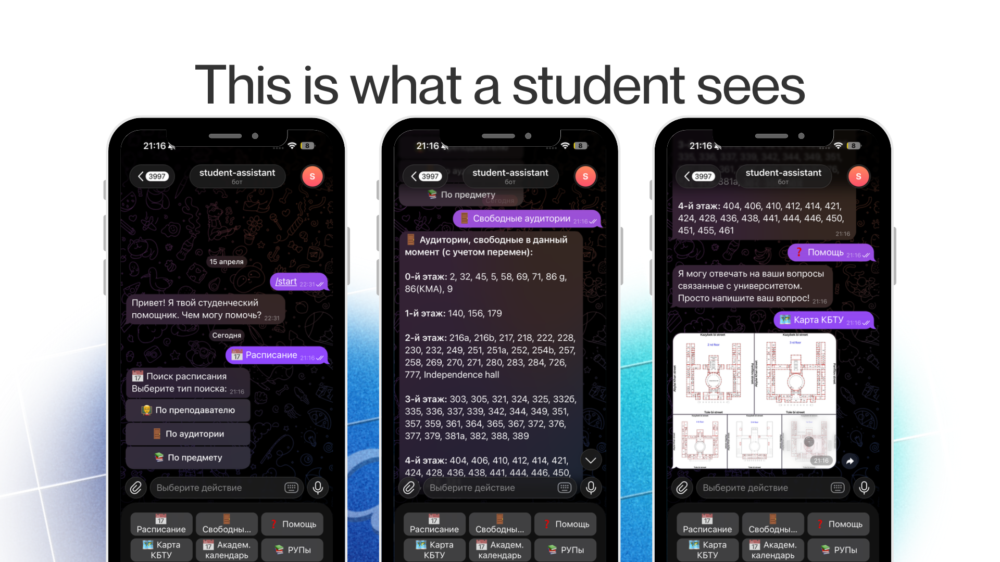
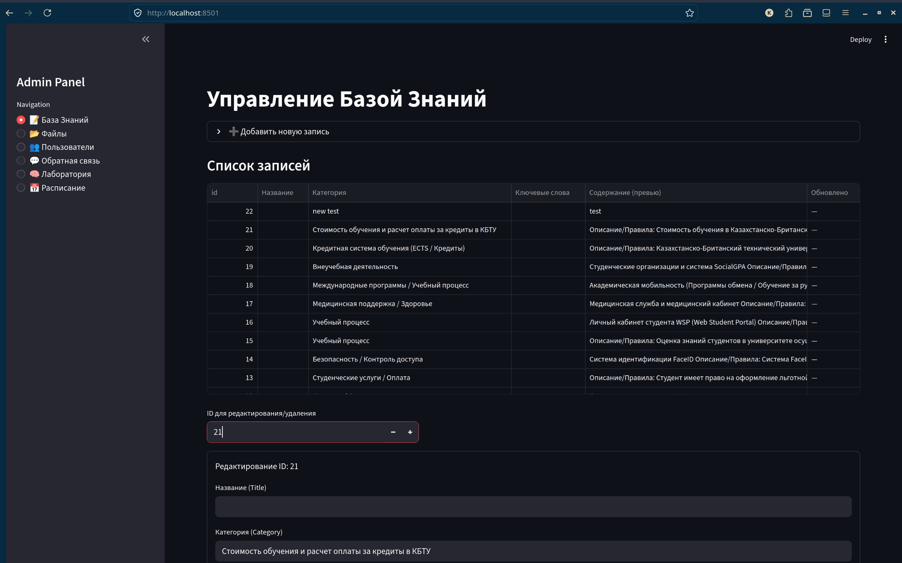
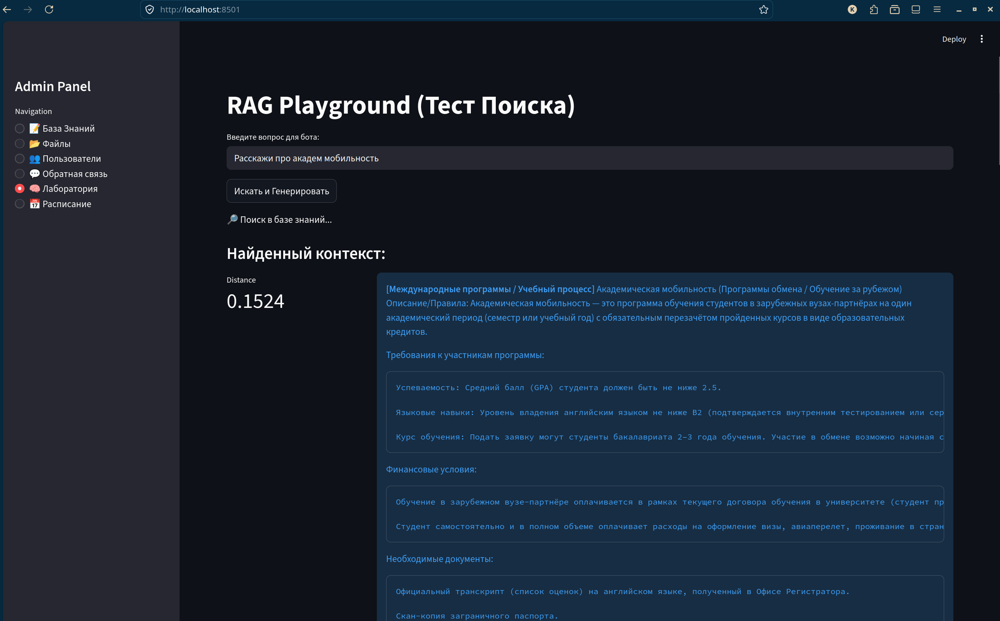

# KBTU Student Assistant Bot — «Асия»

A Telegram RAG bot that answers KBTU students' questions about academic life: procedures (add/drop, retakes), services (dorms, medical centre), schedules, and documents. Built around a curated knowledge base plus a strict vector-search pipeline that refuses to hallucinate.

**[🎥 Watch the YouTube Demo](YOUR_YOUTUBE_LINK_HERE)**

---

## 👋 Meet Asiya

<p align="center">
  
</p>

## 📱 This is what a student sees

<p align="center">
  
</p>

---

## 📸 Admin Interface Preview

*Manage the knowledge base and test the RAG engine directly from the built-in Streamlit admin panel:*

<p align="center">
  
  
</p>

---

## ✨ Features

- **Telegram Bot**: Answers questions, attaches files, and collects user feedback.
- **RAG Pipeline**: Uses Multilingual E5 embeddings and PostgreSQL vector search with strict grounding via Groq LLM to prevent hallucinations.
- **Smart File Attachments**: Links related files to answers through curated paths and keyword fallbacks.
- **Admin Panel**: A complete Streamlit dashboard to manage knowledge, files, users, and test the RAG behavior.
- **WSP Scraper**: Automatically logs into WSP and imports course schedules into the database.

<details>
<summary><b>🧠 How RAG works under the hood (Click to expand)</b></summary>

```text
user question
     │
     ▼
┌─────────────────────────────────────────────────────────────────┐
│  Embed (multilingual-e5-base, "query: " prefix)                │
└─────────────────────────────────────────────────────────────────┘
     │
     ├──► knowledge vector search (top-3, cosine dist ≤ 0.35)
     │        │
     │        ├── matches → build <knowledge> context
     │        │              → Groq LLM answers STRICTLY from it
     │        └── empty    → bot refuses (no LLM call, no quota spent)
     │
     └──► file vector search (top-5)
              │
              ├── CURATED path — always attaches linked files.
              └── FALLBACK path — keyword/distance gated attachment.
```

The LLM system prompt strictly forbids inventing information: if the retrieved context doesn't cover the question, the bot redirects the student to the dean's office.

</details>

---

## 🚀 Quick Start (Local Setup)

### 1. Clone & Configure

```bash
git clone https://github.com/RustamKZ/recfi_ap.git
cd student-assistant-bot
cp example.env .env
```

Open `.env` and add your keys:
- `BOT_TOKEN`: Your Telegram bot token (required to run the bot).
- `GROQ_API_KEY`: Groq API key from [console.groq.com](https://console.groq.com) (required for AI answers).

### 2. Run with Docker

Ensure you have **Docker** and **Docker Compose** installed.

```bash
docker compose up --build
```

This will automatically build and launch:
1. **PostgreSQL** database with pgvector
2. **Telegram Bot**
3. **Admin Panel** 

### 3. Open the Admin Panel

Navigate to **[http://localhost:8501](http://localhost:8501)**. 
Here you can test questions in the **Лаборатория (RAG Playground)**, add new knowledge entries, and monitor users.

---

## 📖 Documentation & Guides

For detailed instructions on adding content, understanding the architecture, and more:

- 📝 **Writing Knowledge base content**: [Guide (EN)](docs/CONTENT_GUIDE_EN.md) | [Guide (RU)](docs/CONTENT_GUIDE_RU.md)
- 🏗 **Architecture overview**: [architecture.md](docs/architecture.md)
- 🚀 **Deployment**: [deployment.md](docs/deployment.md)
- 🧪 **Load Testing**: [load_testing.md](docs/load_testing.md)
